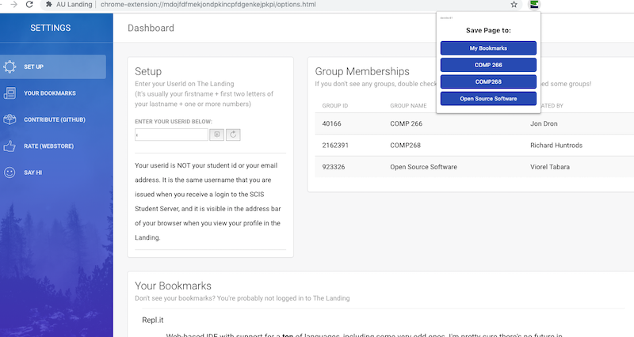

# AU Landing Chrome Bookmarks

This Chrome Extension adds toolbar bookmarks to the AU Landing service in your own account and in groups that you've joined. I created this because bookmarklets are more trouble than they're worth on Chrome, including the need to keep the bookmarks bar visible, and even if that weren't objectionable, each group would need their own bookmarklet because of the way ELGG works.

This extension fixes that issue for me. It probably will not work so well if you've joined more than 10 groups. I will eventually code a way to let users choose which groups they want to create bookmarks in and exlude those they don't, but for now, you're on your own if you've joined every single group on the Landing for giggles.

This plugin was built as I was learning Javascript, so it's probably got a lot of code that could be improved, and probably will be at some point in the future.  

# Installation

- Download the zip and extract it in a permanent location
- Go to chrome://extensions/ in your Chrome browser
- turn on _Developer mode_ and _load unpacked extension_ 
- choose the folder with the extension files to load the extension.
- right click the extension icon in your browser and choose Options. 
- Add your AU username and save. Your bookmarks and available courses should appear on the options page if you entered the correct id.

This extension is not officially supported by or endorsed by Athabasca University.
